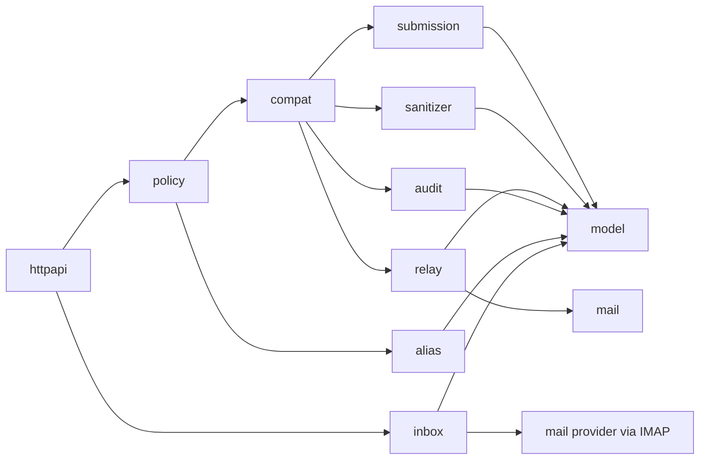

# Architecture Bounded Contexts

## Purpose

This document explains the new internal package boundaries introduced by the privacy-first pivot skeleton.

It is intentionally practical:

- what each package owns
- what each package must not own
- how the current compatibility path works

## Current Context Map

## Package Responsibilities

## `httpapi`

Owns:

- HTTP routes
- request decoding
- response encoding
- method/status mapping

Must not own:

- message transport details
- identity-vault logic
- persistence details for new bounded contexts

## `policy`

Owns:

- current boundary validation for outbound messages
- recipient count and size rules
- alias ownership enforcement in the current message flow

Must not own long-term:

- submission persistence
- relay-attempt modeling
- audit recording details

Current note:

- this remains the compatibility gate for `/v1/messages`

## `compat`

Owns:

- compatibility bridge from the legacy message flow into the new bounded contexts
- translation from `SanitizedMessage` to:
  - `Submission`
  - `RelayAttempt`
  - `AuditEvent`

Must not become:

- the long-term home of core business logic

Current note:

- this is the transitional adapter layer introduced in Phase 1

## `submission`

Owns:

- submission abstraction
- submission repository interface
- submission lifecycle basics

Must not own:

- SMTP delivery
- alias ownership validation
- vault reverse lookups

## `identityvault`

Owns:

- sensitive alias-to-identity linkage
- narrow lookup interface
- future audited reverse lookup path

Must not own:

- public API surface
- general message transport logic

## `sanitizer`

Owns:

- normalized outbound/inbound privacy view
- sanitization result contract
- future metadata-minimization logic

Must not own:

- SMTP transport
- IMAP transport
- persistence

## `relay`

Owns:

- compatibility wrapper around outbound gateway transport
- relay-attempt abstraction
- mapping between submission id and delivery event

Must not own:

- client-facing request handling
- identity mapping rules

## `audit`

Owns:

- audit event model
- audit event recording surface

Must not own:

- authorization policy
- business rules for which events are allowed

## `alias`

Owns:

- current alias lifecycle
- current alias persistence
- alias ownership lookup

Current note:

- remains the live alias source for the compatibility flow
- future vault integration should be additive before any alias-model rewrite

## `inbox`

Owns:

- IMAP sync
- inbound persistence
- cursoring
- normalized inbound message store

Must not own:

- identity-vault lookups
- public submission creation logic

## `mail`

Owns:

- SMTP transport
- recorded outbox persistence
- RFC822 assembly

Must not own:

- client-facing submission abstractions
- vault logic

## Dependency Rules

Allowed directions now:

- `httpapi -> policy`
- `policy -> alias`
- `policy -> compat`
- `compat -> submission`
- `compat -> sanitizer`
- `compat -> relay`
- `compat -> audit`
- `relay -> mail`
- all domain packages -> `model`

Avoid introducing:

- `httpapi -> mail`
- `httpapi -> identityvault`
- `submission -> mail`
- `audit -> mail`
- `identityvault -> httpapi`

## Current Compatibility Path

Today the legacy flow works like this:

1. `POST /v1/messages`
2. `httpapi` decodes input
3. `policy` validates alias ownership and message constraints
4. `compat.MessagesGateway` creates a `Submission`
5. `compat.MessagesGateway` invokes `relay`
6. `relay` uses `mail.Gateway`
7. `compat.MessagesGateway` records an `AuditEvent`
8. the legacy response shape is still returned

This is intentional.
It gives us internal migration without breaking the current API contract.

## What Phase 2 Should Change

Phase 2 should add:

- `POST /v1/submissions`
- explicit `Submission` persistence and retrieval flow
- clearer public separation between:
  - submission acceptance
  - downstream relay attempts

At that point, `compat` should remain only as a bridge for legacy `/v1/messages`, not as the preferred product path.

## Definition Of Success

This bounded-context split is successful when:

- new code lands in the right package by default
- developers do not need to put new privacy-first features into `httpapi`, `policy`, or `mail` directly
- Phase 2 can add `submissions` without another structural re-org
