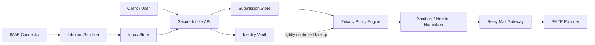

# Privacy-First Pivot Plan

## Purpose

This plan defines how to evolve the current mail-gateway foundation into a broader `privacy-first communication gateway`.

The pivot keeps the current mail-gateway foundation, but changes the product shape from:

- `app talks to alias + mail gateway`

to:

- `client submits through a secure intake layer`
- `identity linkage is isolated`
- `relay processing is separated from intake processing`
- `email becomes one delivery/output boundary, not the primary trust model`

## Strategic Goal

Build a system with these properties:

- secure submission endpoint for sensitive communication
- strict separation between user identity, transport identity, and stored message records
- minimized metadata retention
- mail relay as a controlled downstream transport
- safer inbound and outbound processing boundaries

This is still not a claim of perfect anonymity.
It is a plan for materially stronger privacy architecture than a direct app-to-SMTP/IMAP model.

## What We Already Have

Reusable parts in the current codebase:

- authenticated HTTP API
- alias lifecycle
- outbound message policy layer
- `record-only` safe mode
- SMTP relay mode
- IMAP inbox sync
- local persistence
- encrypted-at-rest file storage
- inbox normalization
- attachment metadata extraction and policy

These are not throwaway work.
They become the starting point for the relay and sanitizer layers.

## Target System Shape

Target high-level architecture:

Core design rule:

- intake, identity mapping, and relay transport should be separate modules with separate storage responsibilities

## New Product Scope

### New Primary User Flows

1. client creates a secure submission channel or alias
2. client submits a message through the secure intake API
3. system stores a minimized submission record
4. system relays outbound mail through a controlled relay boundary when policy allows
5. system ingests inbound responses through IMAP into a sanitized inbox view

### New Supporting Flows

- identity lookup under restricted internal access only
- retention and deletion workflows
- policy-based inbound and outbound gating
- operator troubleshooting without broad content access

## Implementation Principles

- preserve current API where possible and add new flows alongside it
- do not break the current MVP gateway while building the pivot
- keep additive changes first, then migrate callers
- isolate identity data from transport and message data as early as possible
- keep local-dev support via `record-only`

## Workstreams

## Workstream 1: Product And Threat-Model Reset

### Objective

Define the new product boundary precisely before changing code structure.

### Tasks

- rewrite product definition from `mail gateway` to `secure submission + relay`
- update threat model for:
  - intake abuse
  - identity-vault compromise
  - privileged lookup misuse
  - relay/provider leakage
  - retention abuse
- define allowed claims and prohibited claims
- define new MVP and post-MVP boundary for the pivot

### Deliverables

- updated product definition
- updated threat model
- new MVP document for the privacy-first system

## Workstream 2: Architecture Refactor

### Objective

Split the current single-service mental model into clearer internal bounded contexts.

### New Internal Modules

- `intake`
  - submission API
  - client-facing validation
  - replay protection inputs

- `identityvault`
  - user-to-alias mapping
  - access-controlled reverse lookup
  - retention rules

- `relay`
  - outbound mail assembly
  - SMTP delivery
  - relay records

- `sanitizer`
  - header normalization
  - content sanitization
  - attachment metadata policy

- `inbound`
  - IMAP sync
  - inbound normalization
  - response-to-alias mapping

### Tasks

- reorganize packages around bounded contexts
- define interfaces between intake, vault, relay, and inbound
- stop passing broader actor/identity data than needed between modules
- separate message submission record from outbound delivery record

### Deliverables

- new package boundaries
- internal contracts
- migration-safe wiring in `main.go`

## Workstream 3: Secure Intake API

### Objective

Add a true intake-facing surface instead of treating outbound mail submit as the only entrypoint.

### New Concepts

- `submission`
  - client-created message entering the privacy system

- `submission_channel`
  - alias or intake destination associated with a tenant/user/use case

- `submission_status`
  - accepted
  - queued
  - sanitized
  - relayed
  - blocked

### Proposed API Additions

- `POST /v1/submissions`
- `GET /v1/submissions`
- `GET /v1/submissions/:id`

The current `/v1/messages` path can remain during transition, but should become a compatibility path rather than the long-term primary interface.

### Tasks

- define submission request schema
- define submission record model
- implement submission persistence
- add idempotency/replay strategy for clients
- add operator-safe error model

### Deliverables

- new intake endpoints
- frozen submission contract
- transition path from `/v1/messages`

## Workstream 4: Identity Vault

### Objective

Move identity linkage into an explicit restricted module instead of spreading it through general message records.

### New Concepts

- `identity_link`
  - user or source identity to alias/channel mapping

- `vault_lookup_audit`
  - approved lookup trail for sensitive access

### Tasks

- create dedicated identity-vault repository and service
- separate stored alias metadata from reverse-lookup data
- minimize reverse lookup access surface
- add audit event creation for sensitive lookups
- define retention policy for mappings

### Deliverables

- dedicated vault storage
- audited reverse-lookup path
- reduced identity leakage into general stores

## Workstream 5: Sanitization And Metadata Minimization

### Objective

Make the sanitizer a first-class module rather than a side effect of policy checks.

### Outbound Tasks

- define normalized outbound header set
- strip or overwrite optional identifying headers
- keep server-side header assembly only
- normalize text body formatting
- define HTML handling modes:
  - reject
  - sanitize-and-convert
  - metadata-only blocked

### Inbound Tasks

- keep normalized text extraction
- preserve attachment metadata policy
- add explicit safe-content and blocked-content markers at message level
- add provenance marker: raw inbound seen vs sanitized view delivered

### Deliverables

- sanitizer service
- sanitizer tests
- sanitizer policy config surface

## Workstream 6: Relay Hardening

### Objective

Keep SMTP as a downstream controlled boundary, not the center of the system.

### Tasks

- keep current SMTP transport
- add clearer delivery status model:
  - queued
  - sent
  - failed
- split relay record from submission record
- add retry policy for temporary failures
- add operator-safe transport error classification
- ensure sender domain restrictions remain enforced

### Deliverables

- relay record model
- SMTP failure classification
- safer provider-run diagnostics

## Workstream 7: Inbound Reply Model

### Objective

Model inbound mail as a response to a privacy channel, not just a generic inbox fetch.

### Tasks

- enrich inbound message model with channel/submission linkage where possible
- improve mailbox-to-alias mapping logic
- store message-level sanitization result
- maintain cursoring and dedupe
- add clearer message status fields for operator and app use

### Deliverables

- updated inbox model
- better response linkage
- clearer app-facing inbox semantics

## Workstream 8: Retention, Deletion, And Data Minimization

### Objective

Make minimal retention an explicit system feature, not just an aspiration.

### Tasks

- define retention windows for:
  - submissions
  - outbox records
  - inbox records
  - identity links
  - audit events
- implement expiry jobs or operator-triggered cleanup
- allow per-environment retention policy
- document what is deleted and what is retained

### Deliverables

- retention policy config
- cleanup job or command
- retention runbook

## Workstream 9: Access Control And Audit

### Objective

Limit who can correlate identity and content.

### Tasks

- move beyond single dev-token auth model
- add scoped roles:
  - submitter
  - relay-operator
  - vault-admin
  - auditor
- add audit trail for sensitive operations
- add approval-gated identity lookup workflow placeholder

### Deliverables

- role model
- scoped authorization layer
- audit event schema

## Workstream 10: Abuse And Safety Controls

### Objective

Keep the system legitimate and controllable at scale.

### Tasks

- rate limits per actor and per tenant
- submission throttling
- recipient count and domain policy
- blocked attachment and blocked content classifications
- abuse review flags
- safe operator visibility without broad raw-content exposure

### Deliverables

- abuse policy module
- rate limiting
- operator-facing event categories

## Workstream 11: Persistence Upgrade Path

### Objective

Keep file-backed storage for development, but design for a future move to a database-backed production store.

### Tasks

- define repository interfaces for new bounded contexts
- keep file-backed implementations for local/dev
- design migration-ready schemas for:
  - submissions
  - identity links
  - relay records
  - inbox records
  - audit events

### Deliverables

- interface-first repositories
- file-backed reference implementation
- database migration plan

## Workstream 12: Deployment Surfaces

### Objective

Prepare the service to support multiple intake boundaries later.

### Phase 1

- regular HTTPS app/API surface only

### Phase 2

- optional hardened privacy intake deployment profile

### Phase 3

- optional separate intake entrypoint deployment

This plan intentionally avoids putting alternate network-access architectures into the immediate MVP.

### Deliverables

- deployment profiles
- environment matrix
- operator runbook updates

## Data Model Plan

## Current Models To Keep

- `Alias`
- `MessageRecord`
- `InboxMessage`

## New Models To Add

- `Submission`
- `SubmissionStatus`
- `IdentityLink`
- `RelayAttempt`
- `AuditEvent`
- `RetentionPolicy`
- `SanitizationResult`

## Model Changes

### Submission

Represents the client-facing intake event.

Fields:

- `id`
- `tenant_id`
- `channel_id`
- `submitted_by`
- `subject`
- `text_body`
- `attachments_summary`
- `status`
- `created_at`

### RelayAttempt

Represents the downstream delivery event.

Fields:

- `id`
- `submission_id`
- `alias_id`
- `provider`
- `status`
- `failure_class`
- `created_at`

### IdentityLink

Represents sensitive linkage data.

Fields:

- `id`
- `tenant_id`
- `alias_id`
- `real_identity_ref`
- `purpose`
- `created_at`
- `expires_at`

## API Evolution Plan

## Keep For Compatibility

- `GET /healthz`
- `GET /v1/aliases`
- `POST /v1/aliases`
- `POST /v1/messages`
- `GET /v1/messages/outbox`
- `GET /v1/messages/inbox`
- `POST /v1/messages/inbox/sync`

## Add Next

- `POST /v1/submissions`
- `GET /v1/submissions`
- `GET /v1/submissions/:id`
- `GET /v1/channels`
- `POST /v1/channels`

## Add Later

- retention/admin endpoints
- audit review endpoints
- restricted vault lookup endpoints

## Migration Strategy

### Phase A: Stabilize Current Gateway

- finish provider verification
- freeze current contract
- tag current gateway as baseline release candidate

### Phase B: Add Intake Layer Additively

- implement `submissions` without removing `messages`
- keep current gateway behavior as downstream relay path
- document `messages` as compatibility API

### Phase C: Isolate Identity Data

- move alias-to-identity mapping into vault module
- remove unnecessary identity duplication from general records

### Phase D: Promote New Primary Flow

- app/client integrations move to `submissions`
- relay and inbox continue underneath

### Phase E: Deprecate Legacy Primary Path

- keep `/v1/messages` only as explicitly legacy or internal flow if still needed

## Recommended Delivery Phases

## Phase 0: Baseline Freeze

Duration:

- short

Goals:

- complete current provider-backed verification
- preserve green tests
- freeze the current gateway state

## Phase 1: Architecture Skeleton

Goals:

- create module boundaries
- create new repositories and interfaces
- no major behavior changes yet

## Phase 2: Submission Model

Goals:

- add `submissions`
- add status model
- add compatibility wiring to current relay path

## Phase 3: Identity Vault

Goals:

- isolate sensitive linkage
- add audit hooks

## Phase 4: Sanitizer Promotion

Goals:

- move normalization and minimization into explicit service layer
- expand tests around sanitized views

## Phase 5: Relay/Inbound Refactor

Goals:

- split submission records from relay attempts
- improve inbound linkage and statuses

## Phase 6: Retention And Audit

Goals:

- add cleanup logic
- add scoped audit surface

## Phase 7: Authorization Upgrade

Goals:

- move beyond static dev token
- add scoped actor roles

## Testing Strategy

Each phase should include:

- unit tests for new bounded contexts
- integration tests for new API contracts
- migration tests proving old flow still works during transition
- retention and authorization tests where introduced

Critical test themes:

- no open relay regression
- no unauthorized identity lookup
- no raw header injection
- no silent partial-config fallback
- no cross-tenant data leakage

## Release Strategy

## Baseline Release

Release the current gateway as the baseline privacy gateway candidate once live verification passes.

## Pivot Track

Build the privacy-first system on a new tracked branch or milestone series:

- `P1` architecture skeleton
- `P2` submissions
- `P3` identity vault
- `P4` sanitizer promotion
- `P5` retention and audit

## Suggested Immediate Next Steps

In order:

1. complete the first provider-backed verification on the current gateway
2. freeze that state as baseline
3. write a new `privacy-first MVP` document for the pivoted product
4. create the internal module skeleton for:
   - `submission`
   - `identityvault`
   - `sanitizer`
   - `relay`
   - `audit`
5. implement `POST /v1/submissions` as the first additive pivot feature

## Recommended Definition Of Success

The pivot is successful when:

- clients submit through a secure intake model rather than treating raw message send as the primary abstraction
- identity linkage is isolated and access-controlled
- relay transport is downstream and constrained
- inbound and outbound records expose sanitized views
- retention and audit are explicit features
- the system still preserves the practical gateway value already built
