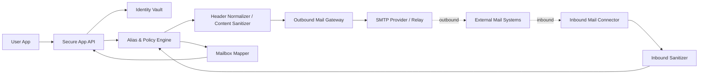

# Privacy-Preserving Email Gateway Architecture

## Goal

Create a lawful privacy-first application that sits between a user-facing app and traditional email infrastructure:

```text
APP <-> ANONYMIZER <-> SMTP / IMAP / POP3
```

The system goal is:

- minimize user-identifying metadata
- separate user identity from transport identity
- harden storage, keys, and transport
- reduce accidental leakage
- keep abuse prevention and policy controls intact

The system goal is **not**:

- “perfect anonymity”
- undeclared spoofing
- open-relay behavior
- bypassing provider policy, legal constraints, or abuse controls

## Non-Negotiable Constraint

Standard internet email cannot provide absolute anonymity.

Reasons:

- SMTP relays add trace information as mail moves through the system.
- standard message formats require origin-related fields such as date and sender information
- providers and operators still have transport logs and account events
- recipients, providers, and relay operators can still infer metadata even when content is encrypted

So the correct requirement is:

**maximum practical privacy and security within the limits of standard email**

not:

**untraceable email**

## Recommended High-Level Architecture



## Core Design Decision

Do **not** let the app speak raw SMTP, IMAP, or POP3 directly if privacy is the main goal.

Instead:

- the app talks only to the anonymizer over a hardened application API
- the anonymizer is the only component that speaks SMTP/IMAP/POP3

This is the cleanest way to prevent client metadata leakage and to centralize security controls.

## Protocol Guidance

### Outbound

- Prefer **SMTP submission via the anonymizer only**
- The anonymizer should sign and send mail using a domain it controls
- Do not let end users spoof arbitrary third-party domains

### Inbound

- Prefer **IMAP** for retrieval and synchronization
- Treat **POP3** as legacy-compatibility only
- If POP3 is supported at all, isolate it behind a connector and do not let it shape the primary product model

### Transport Security

- Use TLS for all mail transport
- Use strong server authentication and strict trust configuration
- Keep the app-to-anonymizer connection separate from the mail-protocol layer

## Privacy Model

The anonymizer should reduce linkage between:

- the real user identity
- the visible sender identity
- the mailbox/provider account used for transport

Recommended privacy mechanics:

- per-user or per-thread alias addresses
- sender identity rewriting to anonymizer-controlled addresses
- strict header normalization
- stripping of optional fingerprinting headers
- sanitization of HTML and remote-content references where feasible
- attachment normalization or safe re-packaging where justified

Avoid calling this “anonymous email”.

Call it:

- privacy-preserving relay
- metadata-minimizing mail gateway
- aliasing and shielding layer

## Security Boundaries

### 1. App Layer

Responsibilities:

- user authentication
- message composition
- local protection for drafts and session data
- explicit consent and visibility around what is anonymized and what is not

### 2. Identity Vault

Responsibilities:

- map real users to aliases
- store the minimum mapping data required
- keep identity linkage separate from transport processing

Requirements:

- encrypt at rest
- strict access control
- short retention where possible
- separate admin access from mail operations

### 3. Alias and Policy Engine

Responsibilities:

- create alias identities
- choose routing rules
- apply outbound and inbound policy
- enforce allowed sender domains and recipient rules

### 4. Header Normalizer and Sanitizer

Responsibilities:

- remove or rewrite non-essential identifying headers
- normalize message formatting
- strip client fingerprinting headers such as mailer identifiers when safe
- sanitize active content where appropriate

### 5. Mail Gateway

Responsibilities:

- send via SMTP
- receive via IMAP or POP3 connectors
- sign outbound messages using the anonymizer domain
- maintain provider compatibility without exposing direct client identity

## Abuse-Resistant Guardrails

This layer is essential.

Without it, the same system could become a spam, phishing, or harassment tool.

Required guardrails:

- authenticated users only
- no open relay
- no sending from domains the system does not control
- per-user and per-tenant rate limits
- reputation and anomaly controls
- recipient volume controls
- attachment and content risk scanning
- legal and abuse response workflow
- minimum necessary audit trails with strong internal access controls

## What Should Be Minimized

- direct exposure of client IPs to external mail systems
- optional identifying headers
- unnecessary retention of identity-to-alias mappings
- unnecessary retention of message bodies
- broad internal access to identity linkage

## What Cannot Honestly Be Hidden

- the fact that the message came through the anonymizer domain or relay
- metadata visible to the anonymizer operator
- metadata visible to the outbound provider
- delivery path evidence added by mail infrastructure
- timing and correlation clues in some threat models

## Threat Model Summary

### Protected Better Against

- casual recipient inspection of the sender’s real address
- leakage from mail client headers and direct client fingerprinting
- simple cross-account linkage
- accidental identity exposure by end users

### Not Fully Protected Against

- the anonymizer operator
- the outbound email provider
- legal process served on the operator/provider
- advanced traffic analysis
- endpoint compromise on the sender device or recipient side

## Recommended Product Positioning

Promise:

- aliasing
- metadata reduction
- domain shielding
- stronger transport and storage security
- controlled separation of user identity from email identity

Do not promise:

- perfect anonymity
- invisibility
- immunity from provider logging
- immunity from legal attribution

## v1 Recommendation

Build v1 as:

- app -> hardened API
- identity vault
- alias management
- SMTP outbound via anonymizer-controlled domain
- IMAP inbound connector
- strict header normalization
- basic HTML/content sanitization
- key management and encrypted storage
- rate limits and abuse controls

Leave out of v1:

- POP3 except as isolated legacy compatibility
- complex traffic-shaping features
- anything that prioritizes concealment over safety and abuse control

## Suggested Next Build Steps

1. Define the threat model in detail
2. Define exactly which headers are preserved, rewritten, or dropped
3. Define alias lifecycle rules
4. Define key-management and storage boundaries
5. Define abuse-prevention policy
6. Prototype outbound SMTP path first
7. Add IMAP-based inbound path second

## Bottom Line

If the requirement is truly “maximal anonymity,” standard email is the wrong primitive.

If the requirement is:

- strong privacy
- reduced metadata leakage
- secure relay
- safer operator-controlled aliasing

then this architecture is the right direction.
