# Antigravity Vector-Tree Architecture Map

Tento soubor byl automaticky vygenerován pro poskytnutí maximálního kontextu AI agentům.

## 🗺️ Topologie Uzlů (Mermaid Graf)

```mermaid
graph TD
  supply["supply (supply)"]
  style supply stroke:#ff9900,stroke-width:2px
  sale["sale (sale)"]
  style sale stroke:#ff9900,stroke-width:2px
  engine["engine (engine)"]
  style engine stroke:#ff9900,stroke-width:2px
  demand["demand (demand)"]
  style demand stroke:#ff9900,stroke-width:2px
  outreach-dashboard["outreach-dashboard (platform)"]
  style outreach-dashboard stroke:#ff9900,stroke-width:2px
  demo-invoicing["demo-invoicing (sale)"]
  style demo-invoicing stroke:#ff9900,stroke-width:2px
  engine-learn["engine-learn (engine)"]
  style engine-learn stroke:#3399ff,stroke-width:3px,fill:#cce5ff,color:#333
  engine-drive["engine-drive (engine)"]
  style engine-drive stroke:#3399ff,stroke-width:3px,fill:#cce5ff,color:#333
  demand-search["demand-search (spine)"]
  style demand-search stroke:#ff9900,stroke-width:2px
  demand-discover["demand-discover (demand)"]
  style demand-discover stroke:#3399ff,stroke-width:3px,fill:#cce5ff,color:#333
  engine-learn-action-graph["engine-learn-action-graph (engine)"]
  style engine-learn-action-graph stroke:#ff9900,stroke-width:2px
  engine-drive-write["engine-drive-write (engine)"]
  style engine-drive-write stroke:#ff9900,stroke-width:2px
  engine-drive-read["engine-drive-read (engine)"]
  style engine-drive-read stroke:#ff9900,stroke-width:2px
  demand-discover-crawl["demand-discover-crawl (demand)"]
  style demand-discover-crawl stroke:#ff9900,stroke-width:2px
  undefined["undefined (unknown)"]
  style undefined stroke:#00cc66,stroke-width:1px
```

## 🗂️ Seznam Uzlů

### `supply`
- **Cesta:** `spine/supply`
- **Osa příběhu (Story Axis):** supply
- **Stav:** pending

### `sale`
- **Cesta:** `spine/sale`
- **Osa příběhu (Story Axis):** sale
- **Stav:** pending

### `engine`
- **Cesta:** `spine/engine`
- **Osa příběhu (Story Axis):** engine
- **Stav:** pending

### `demand`
- **Cesta:** `spine/demand`
- **Osa příběhu (Story Axis):** demand
- **Stav:** pending

### `outreach-dashboard`
- **Cesta:** `spine/platform/outreach-dashboard`
- **Osa příběhu (Story Axis):** platform
- **Stav:** pending
- **Původ (Origin):** hozan-taher/features/platform

### `demo-invoicing`
- **Cesta:** `spine/sale/demo-invoicing`
- **Osa příběhu (Story Axis):** sale
- **Stav:** pending

### `engine-learn`
- **Cesta:** `spine/engine/learn`
- **Osa příběhu (Story Axis):** engine
- **Stav:** pending
- **Původ (Origin):** frontier
- **Tagy:** action-graph, selectors, replay-model

### `engine-drive`
- **Cesta:** `spine/engine/drive`
- **Osa příběhu (Story Axis):** engine
- **Stav:** pending
- **Původ (Origin):** frontier
- **Tagy:** session, read, write, rate-policy

### `demand-search`
- **Cesta:** `spine/demand/search`
- **Osa příběhu (Story Axis):** spine
- **Stav:** pending

### `demand-discover`
- **Cesta:** `spine/demand/discover`
- **Osa příběhu (Story Axis):** demand
- **Stav:** pending
- **Původ (Origin):** frontier
- **Tagy:** crawl, fingerprint, bot, discovery

### `engine-learn-action-graph`
- **Cesta:** `spine/engine/learn/action-graph`
- **Osa příběhu (Story Axis):** engine
- **Stav:** pending

### `engine-drive-write`
- **Cesta:** `spine/engine/drive/write`
- **Osa příběhu (Story Axis):** engine
- **Stav:** pending

### `engine-drive-read`
- **Cesta:** `spine/engine/drive/read`
- **Osa příběhu (Story Axis):** engine
- **Stav:** pending

### `demand-discover-crawl`
- **Cesta:** `spine/demand/discover/crawl`
- **Osa příběhu (Story Axis):** demand
- **Stav:** pending

### `undefined`
- **Cesta:** `products/auction24/features/platform/admin/list-latency`
- **Osa příběhu (Story Axis):** N/A
- **Stav:** met

